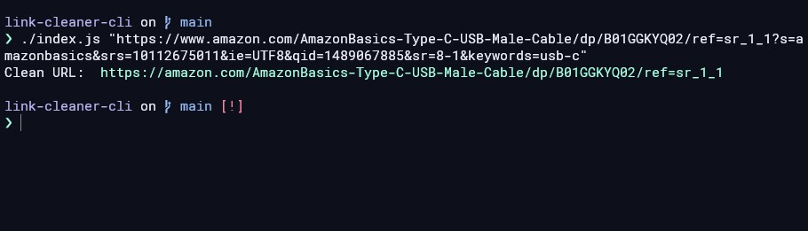

## Link Cleaner CLI

> Debopam Gupta 2022
> Inspiration - https://github.com/corbindavenport/link-cleaner

A Link Cleaner CLI tool to clean up your links.
This gets rid of the various tracking parameters and other parameters that are added to the links.

_Currently, Links which redirect one to other webpages, are not supported.. Looking into that soon._

_There is a plan to publish this to npm as well._

## Planned Usage -

```bash
linkcl [options] (url)
```



---

## Research

- https://stackoverflow.com/questions/161738/what-is-the-best-regular-expression-to-check-if-a-string-is-a-valid-url
- https://gist.github.com/dperini/729294
- List Of Tracking URLs - https://github.com/apiraino/link_cleaner/blob/master/test_urls.md
